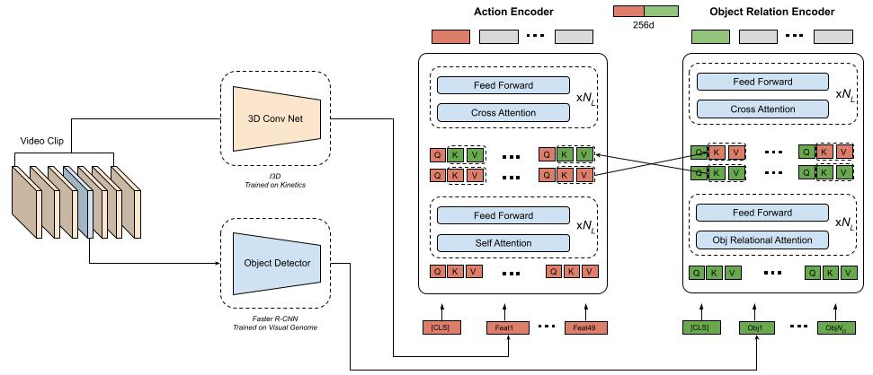
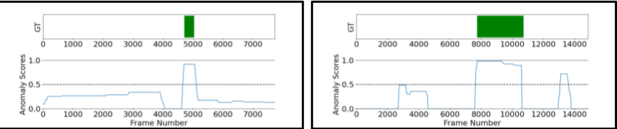

# [BMVC 2023] VADOR: Real World Video Anomaly Detection with Object Relations and Action

Official PyTorch Implementation of [VADOR: Real World Video Anomaly Detection with Object Relations and Action](link)

VADOR detects and localizes anomalies in time domain with leveraging action and relationships of objects in video




```
data/
├── Annotations
│   ├── Train
│   ├── Test
├── extracted_features
│   ├── test
│   ├── train
└   └── train_flip
```

## Results



[//]: # (![pipeline]&#40;docs/Burglary079_x264.png&#41;)


## Citation

If you find our work to be useful for your research, please consider citing.

```

@inproceedings{ozturk2021adnet,
  title={ADNet: Temporal anomaly detection in surveillance videos},
  author={{\"O}zt{\"u}rk, Halil {\.I}brahim and Can, Ahmet Burak},
  booktitle={Pattern Recognition. ICPR International Workshops and Challenges: Virtual Event, January 10--15, 2021, Proceedings, Part IV},
  pages={88--101},
  year={2021},
  organization={Springer}
}
```
